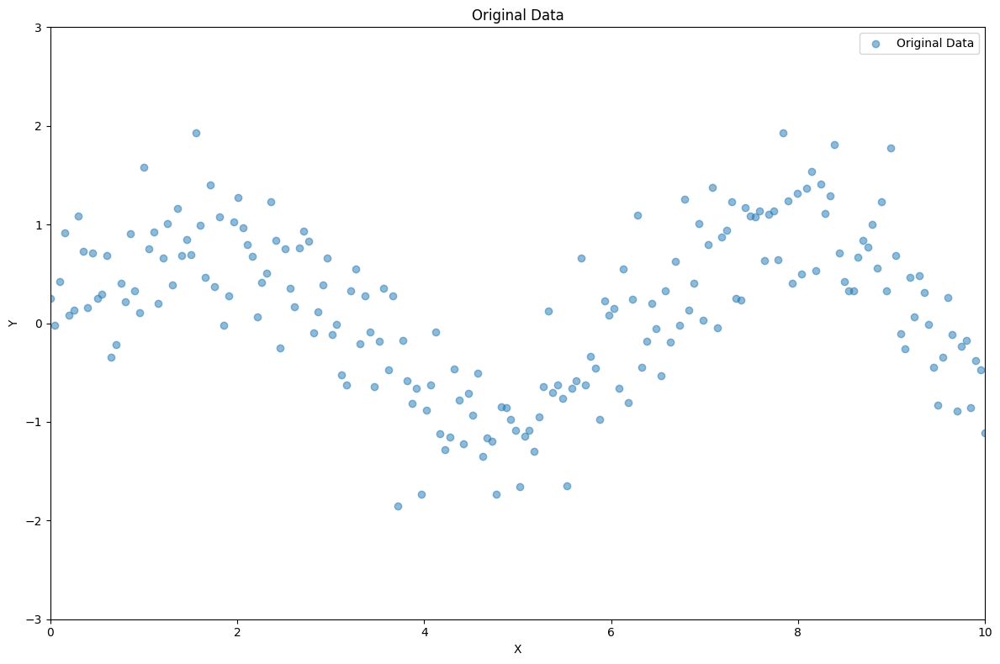
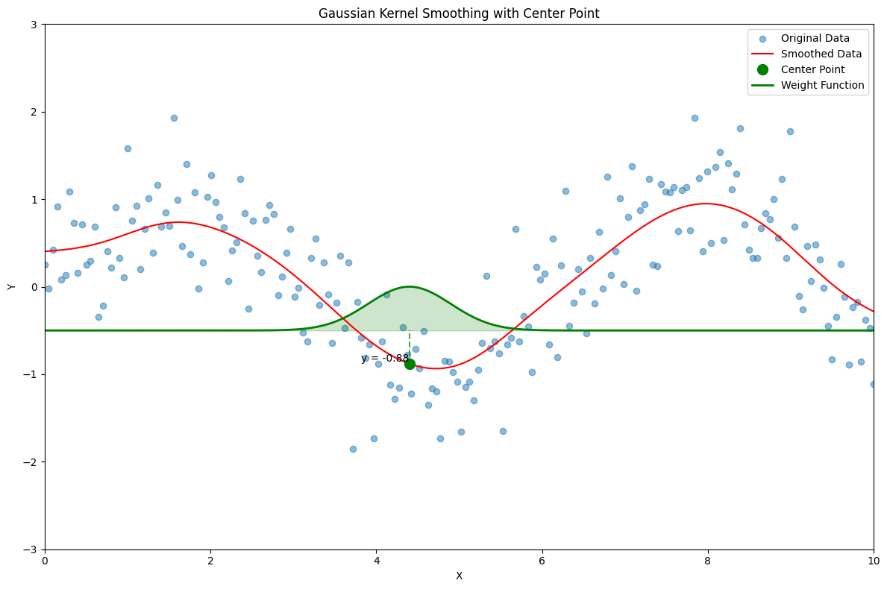
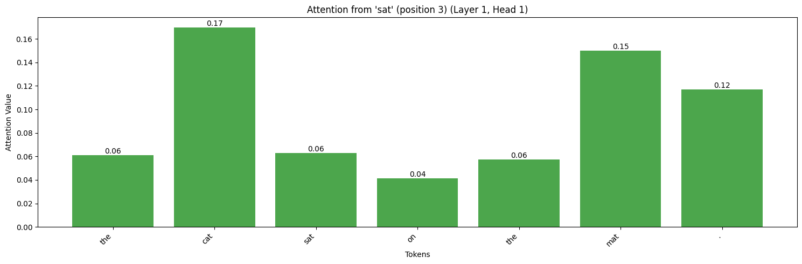

---
Understanding Transformers Through the Lens of Kernel Smoothing
---
Peter Overholser
---

# Kernel Smoothing
 
Let's imagine we've collected some data generated by the process
$Y  = f(X) + \epsilon$, where $f$ is a continous function and $\epsilon$  is noise (a normally distributed random variable with standard deviation $\sigma$ and mean 0).  This situation is common in practice, at least roughly speaking.  
Some data generated by such a process is pictured below:

When we're presented with this type of data, one important goal is to uncover the true relationship between $Y$ and $X$.  In this case, it looks like $f$ might be some sort of sinusoidal function, but how can we start to recover it?

Let's imagine what we could do if we had a lot more data.  In fact, let's assume we had $N$ samples of $Y$ for every value of $X$ that we cared about.  How well can we then estimate $f(x)$?  For a given $x_0$, let's take the average of all of the associated $y$ values, and call the result $\hat{y}$.

If we repeated this process a bunch of times, the mean value $\hat{y}$ will be $f(x_0)$, with variance equal to $\sigma^2/N$, which is small if $N$ is large.  That is, if we have enough data, we can just take a mean of all of the $y$ values for a given $x$, and this should yield a value very close to $f(x)$.

Unfortunately, we rarely have *enough* data, let alone *enough data for each value of $x$*, so we'll need to figure out another way to try and zero out that $\epsilon$ term.

We didn't assume much about $f(x)$, but we did assume that it's continuous.  This means that $f(x_1)$ should be close to $f(x_0)$ if $x_1$ and $x_0$ are close, and $y_1$ might have something helpful to say about $f(x_0)$.  From what I've seen, a lot of machine learning and statistics comes down to figuring out how best to express that "something helpful". 

Kernel smoothing is a simple idea.  In order to estimate $f(x_0)$ for a given value of $x$, instead of taking the average of many values of $y$ at $x_0$ (because we don't have this kind of data available), we take the *weighted* average of many $y_i$ values stemming from observations $(x_i, y_i)$, where the weighting of each $y_i$ is determined by the distance between $x_0$ and $x_i$.  In general, the closer away $x_i$ is to $x_0$, the more it contributes to the average.  This makes sense, because the $f(x_0)$ should be pretty close to $f(x_i)$ in this case.

One common practice is the use of a Gaussian kernel.  In this case, the relative weighting of an observation $(x_i, y_i)$ in estimating $f(x_0)$ is given by $$e^{-\frac{(x_i - x_0)^2}{2b^2}},$$ where $b$ (the *bandwidth*) is a hyperparameter defining the width of the kernel.  The larger $b$ is, the more distant points contibute to the resulting estimate for $f(x_0)$.

You can play around with this idea here: [Kernel smoothing notebook](https://colab.research.google.com/drive/1y9ks-bhffxS2X_1_0Q1j45TFrlzPJpEC?usp=sharing)

One interesting thing to notice is that, because a Gaussian kernel is symmetrical, you can get away with using a large $b$ (thus enlisting far-flung points to your aid) if the function $f$ you're attempting to approximate is nearly linear.  

# Transformers
Transformer networks are distinguished by the presence of a so-called *attention mechanism*.  We're going to attempt to understand this as a reincarnation of kernel smoothing.  

Transformers are most famously deployed as language models, such as ChatGPT.  ChatGPT and its friends are simply machines that, when given a sequence of words (in reality, pieces of words called *tokens*, but we're going to ignore that technicality here), attempt to predict the next word.  This turns out to be a pretty thorny problem.

One early approach to this problem was through the use of Markov chains.  Given a sequence of words, you can look at all other other times that this sequence has occurred in the history of written language, and count up the number of times each word in your vocabulary immediately follows the sequence.  The word that does so most often is then most probable to follow the given sequence.  

One obvious issue is that lots of meaningful phrases have no previous occurrences in human history.  For example "Here at Cal Poly Humboldt, Founder's Hall's roof is the same color as the wood of our favorite tree, the mighty ..." most likely has never before been written or uttered.  And yet we all can guess which word comes next.

How do we do this?  Instead of using the mere words to guess which word comes next, we use their meaning.  In other words, we're using *semantics* rather than *syntax*. 

Transformers attempt to model semantics through the use of embeddings.  Each word is assigned a vector,  and words which tend to show up in similar contexts are given similar vectors.  Because you can guess a word's meaning by its context, words with similar meanings are also given similar vectors.  The problem here is that words often have many different meanings, and thus a single vector is not adequate to express the range of possible meanings that a word might take on.  This gap between general meaning and contextual meaning serves a similar role to $\epsilon$ in the kernel smoothing discussion above.

In addition to a vector meant to capture its semantic meaning (a *value vector*), each word is also equipped with so-called *key* and *query* vectors.  The query vector of word *a* word, when dotted with the key vector of word *b*, yields a quantity (*attention value*) meant to quantify how useful the meaning of *b* is for understanding *a*.  In the crucial *attention* step of the transformer, the value vector for each word is replaced with a weighted average of the value vectors of the other words that appear in the phrase the transformer is trying to understand.  Rather than being governed by simple distance from a given point to all the other points, as in the kernel smoothing example, the weighting is governed by the value of the dot between the given word's query and the other words' key vectors.  Thus, though the meaning of the different words in the context are different, they're helpful in moving between the general and contextual meaning for a given word.

That's the magic sauce of GPTs-- everything else is just simple feedforward neural networks and linear projections.

You can explore this idea here: [Attention Notebook](https://colab.research.google.com/drive/1K97THGj9wxRa9jLPtApQWu7XxOLLLEnn?usp=sharing)
